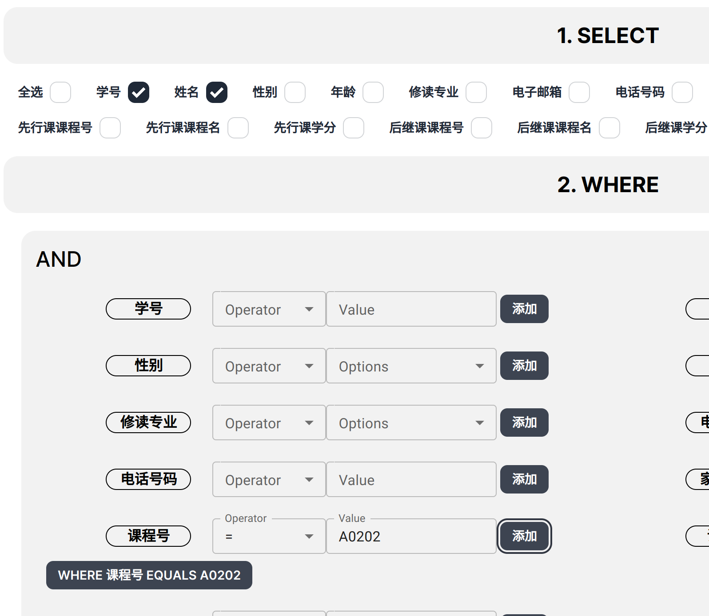
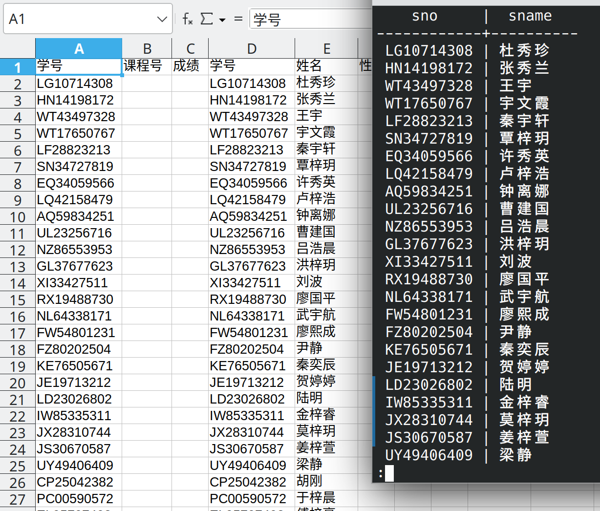

# 查询选修 1 号课程的学生学号与姓名

```sql copy
SELECT "public"."S"."sno", "public"."S"."sname" 
    FROM "public"."S", "public"."SC"
WHERE "public"."S"."sno" = "public"."SC"."sno" 
    AND "public"."SC"."cno" = '1';
```



---

