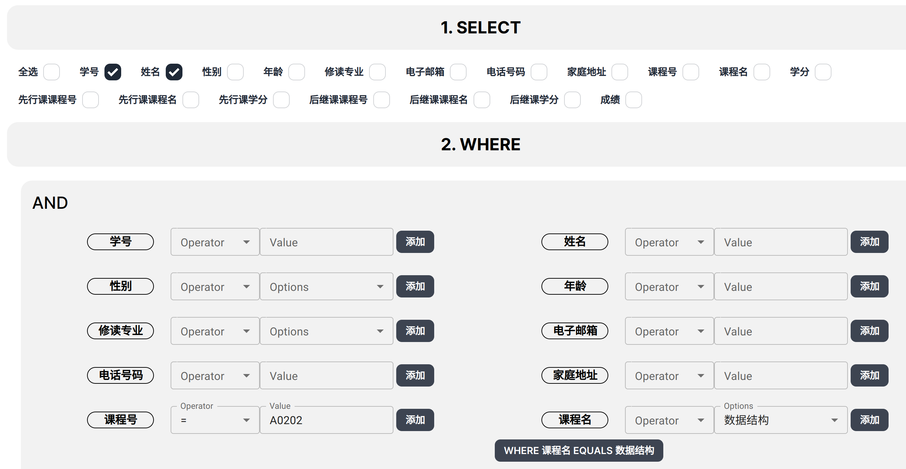
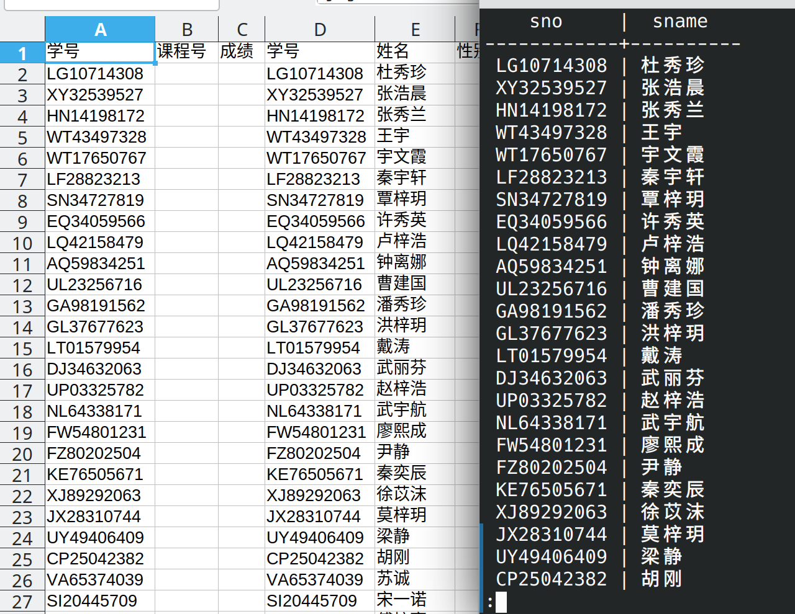

# 查询选修课程名为数据结构的学生学号与姓名

```sql copy
SELECT "public"."S"."sno", "public"."S"."sname"
    FROM "public"."S", "public"."SC", "public"."C"
WHERE "public"."S"."sno" = "public"."SC"."sno"
    AND "public"."SC"."cno" = "public"."C"."cno"
    AND "public"."C"."cname" = 'Data_Structure';
```



---

