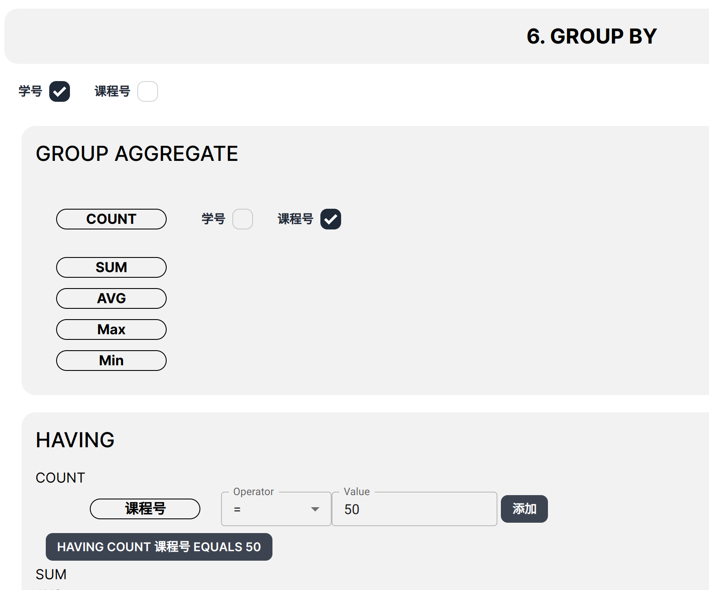
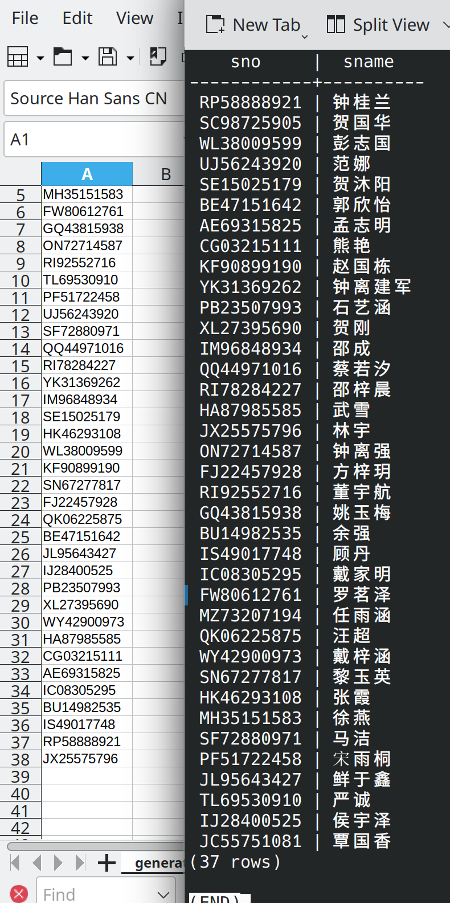

# 查询学习全部课程学生姓名

```sql copy
SELECT "public"."S"."sno", "public"."S"."sname"
    FROM "public"."S"
WHERE NOT EXISTS (
    SELECT * FROM "public"."C"
    WHERE NOT EXISTS (
        SELECT * FROM "public"."SC"
        WHERE "public"."SC"."sno" = "public"."S"."sno"
        AND "public"."SC"."cno" = "public"."C"."cno"
    )
);
```

```sql copy
SELECT "public"."S"."sno", "public"."S"."sname"
    FROM "public"."S"
INNER JOIN "public"."SC" ON "public"."S"."sno" = "public"."SC"."sno"
GROUP BY "public"."S"."sno", "public"."S"."sname"
    HAVING COUNT("public"."SC"."sno") = (
        SELECT COUNT(*) FROM "public"."C"
    );
```


---



---

