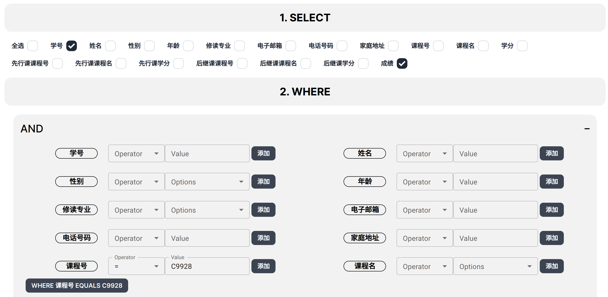
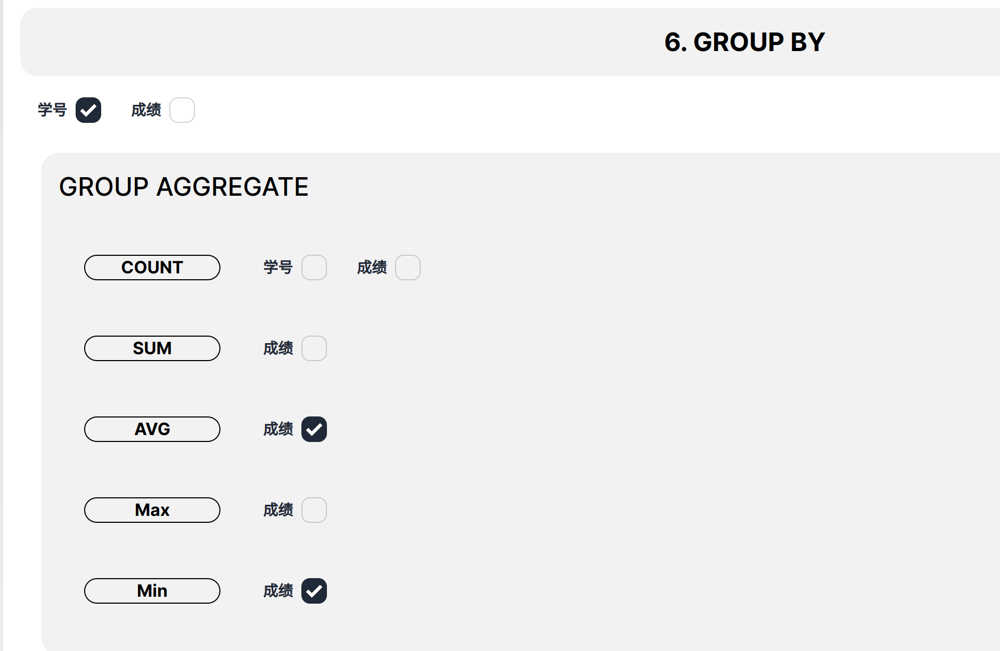
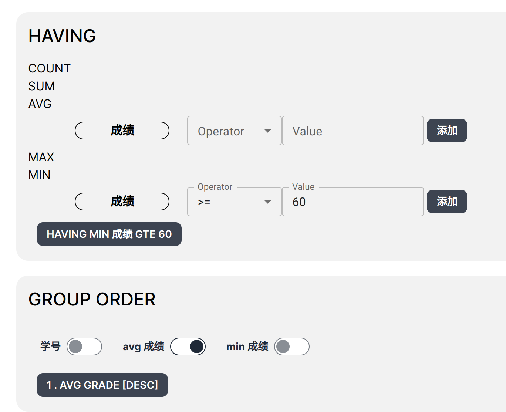
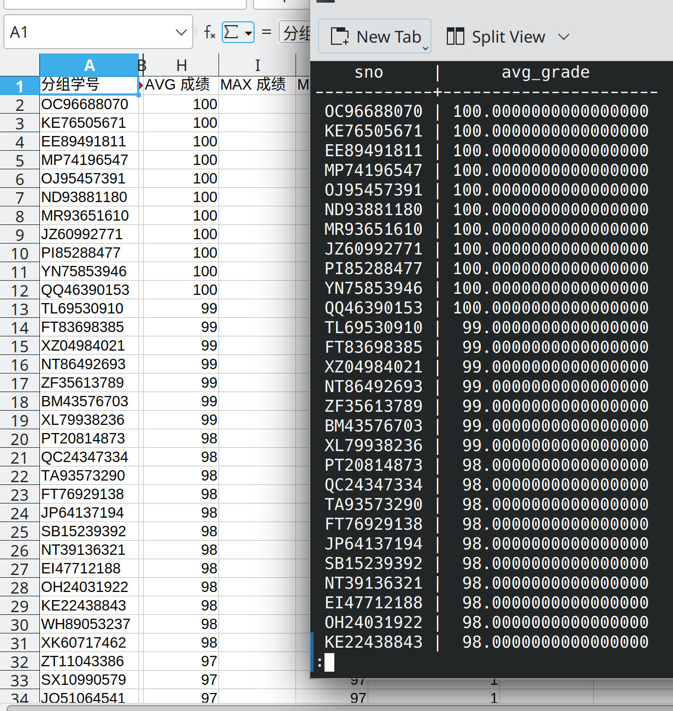

# 查询所有学生除了选修 1 号课程外所有成绩均及格的学生的学号和平均成绩，其结果按平均成绩的降序排列

```sql copy
SELECT "public"."SC"."sno", AVG("public"."SC"."grade") AS avg_grade
FROM "public"."SC"
WHERE "public"."SC"."cno" = '1'
GROUP BY "public"."SC"."sno"
HAVING MIN("public"."SC"."grade") >= 60
ORDER BY avg_grade DESC;
```



---



---



---

