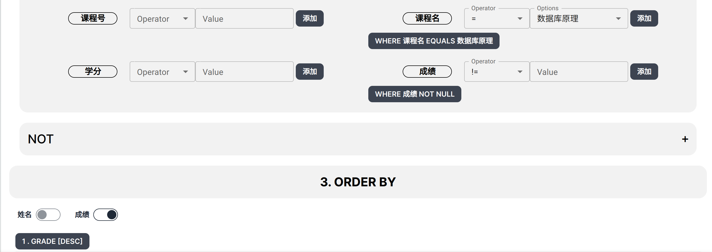
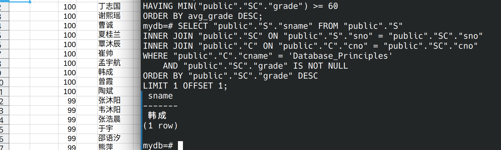

# 查询选修数据库原理成绩第 2 名的学生姓名

```sql copy
SELECT "public"."S"."sname" FROM "public"."S"
INNER JOIN "public"."SC" ON "public"."S"."sno" = "public"."SC"."sno"
INNER JOIN "public"."C" ON "public"."C"."cno" = "public"."SC"."cno"
WHERE "public"."C"."cname" = 'Database_Principles'
    AND "public"."SC"."grade" IS NOT NULL
ORDER BY "public"."SC"."grade" DESC
LIMIT 1 OFFSET 1;
```


---



---



***可能会出现名次并列的情况***
