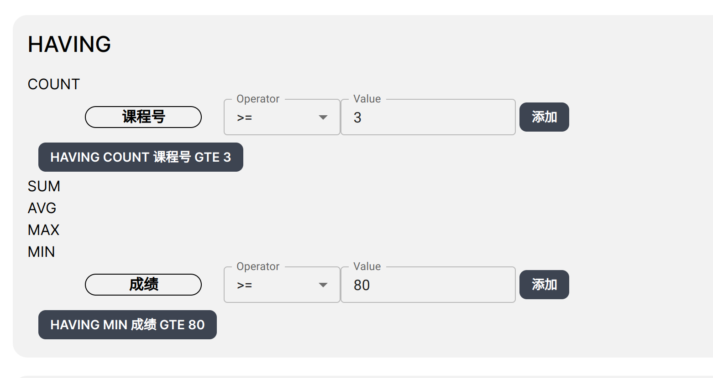

# 查询所有 3 个学分课程中有 3 门以上（ 含 3 门 ）课程获 80 分以上（ 含 80 分 ）的学生的姓名

```sql copy
SELECT "public"."S"."sno", "public"."S"."sname" FROM "public"."S"
INNER JOIN "public"."SC" ON "public"."S"."sno" = "public"."SC"."sno"
INNER JOIN "public"."C" ON "public"."SC"."cno" = "public"."C"."cno"
WHERE "public"."C"."credit" = 3
GROUP BY "public"."S"."sno", "public"."S"."sname"
HAVING COUNT(*) >= 3 AND MIN("public"."SC"."grade") >= 80;
```


---


---


---

